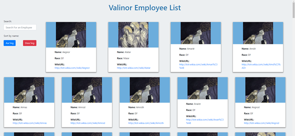

# Silmaril-Gram

A React app to view your entire employee directory.

## Installation

This application is made using React and requires the following NPM modules: axios, bootstrap, react, react-dom,react-scripts, and web-vitals.  The data populating the current version of the app comes from a Tolkien API at: https://the-one-api.dev/documentation. 

## Usage 

The application is deployed to: https://christopher-cruzcosa.github.io/silmaril-gram/ 

The user only sees a main screen showing all employee records as cards.  Each card has a character's name, race, and wiki artice link.  A single image shows for each distinctive race in Tolkien's books.  The user can search for the name of a user by typing in the input box and also has the ability to sort by name in either ascending or descneding order, by clicking one of two buttons.

-----

Below is screenshot of the app interface.

## Credits

Created by: Christopher Cruzcosa

## License

Copyright (c) [2020] [Christopher Cruzcosa]

Permission is hereby granted, free of charge, to any person obtaining a copy
of this software and associated documentation files (the "Software"), to deal
in the Software without restriction, including without limitation the rights
to use, copy, modify, merge, publish, distribute, sublicense, and/or sell
copies of the Software, and to permit persons to whom the Software is
furnished to do so, subject to the following conditions:

The above copyright notice and this permission notice shall be included in all
copies or substantial portions of the Software.

THE SOFTWARE IS PROVIDED "AS IS", WITHOUT WARRANTY OF ANY KIND, EXPRESS OR
IMPLIED, INCLUDING BUT NOT LIMITED TO THE WARRANTIES OF MERCHANTABILITY,
FITNESS FOR A PARTICULAR PURPOSE AND NONINFRINGEMENT. IN NO EVENT SHALL THE
AUTHORS OR COPYRIGHT HOLDERS BE LIABLE FOR ANY CLAIM, DAMAGES OR OTHER
LIABILITY, WHETHER IN AN ACTION OF CONTRACT, TORT OR OTHERWISE, ARISING FROM,
OUT OF OR IN CONNECTION WITH THE SOFTWARE OR THE USE OR OTHER DEALINGS IN THE
SOFTWARE.
